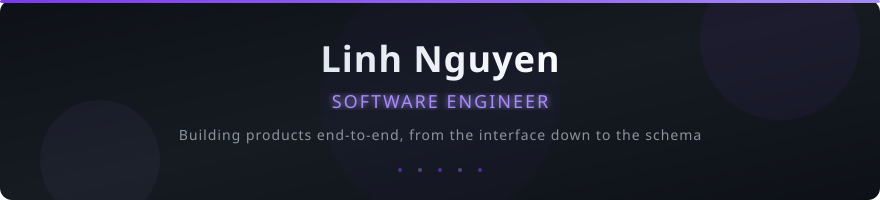

<!-- Header Banner -->
<a href="https://linhnguyen96114.vercel.app/">
  <picture>
    <source media="(prefers-color-scheme: dark)" srcset="./assets/header-dark.svg" />
    <source media="(prefers-color-scheme: light)" srcset="./assets/header-light.svg" />
    
  </picture>
</a>

<!-- Social Links -->
<div align="center">
  <a href="https://linhnguyen96114.vercel.app/">
    
  </a>&nbsp;
  <a href="https://www.linkedin.com/in/linh-nguyen-3277801ab/">
    
  </a>&nbsp;
  <a href="mailto:linh.nguyen96114@gmail.com">
    
  </a>&nbsp;
  <a href="https://github.com/linhnguyen-gt">
    
  </a>
</div>

<br/>

<!-- About -->

## `> whoami`

```yaml
name: Linh Nguyen
location: Vietnam 🇻🇳
role: Mobile Developer
focus:
  - Cross-platform mobile development
  - Clean architecture & state management
  - Open-source tooling for mobile community
currently:
  - Building developer tools for React Native & Flutter
  - Contributing to mobile open-source ecosystem
```

<!-- Tech Stack -->

## 🛠️ Tech Stack

<table>
  <tr>
    <td align="center" width="96">
      <strong>Mobile</strong>
    </td>
    <td>
      <a href="https://github.com/linhnguyen-gt?tab=repositories&q=&type=&language=&sort=stargazers#gh-dark-mode-only">
        
      </a>
      <a href="https://github.com/linhnguyen-gt?tab=repositories&q=&type=&language=&sort=stargazers#gh-light-mode-only">
        
      </a>
    </td>
  </tr>
  <tr>
    <td align="center" width="96">
      <strong>Languages</strong>
    </td>
    <td>
      <a href="https://github.com/linhnguyen-gt?tab=repositories&q=&type=&language=&sort=stargazers#gh-dark-mode-only">
        
      </a>
      <a href="https://github.com/linhnguyen-gt?tab=repositories&q=&type=&language=&sort=stargazers#gh-light-mode-only">
        
      </a>
    </td>
  </tr>
  <tr>
    <td align="center" width="96">
      <strong>Backend</strong>
    </td>
    <td>
      <a href="https://github.com/linhnguyen-gt?tab=repositories&q=&type=&language=&sort=stargazers#gh-dark-mode-only">
        
      </a>
      <a href="https://github.com/linhnguyen-gt?tab=repositories&q=&type=&language=&sort=stargazers#gh-light-mode-only">
        
      </a>
    </td>
  </tr>
  <tr>
    <td align="center" width="96">
      <strong>Tools</strong>
    </td>
    <td>
      <a href="https://github.com/linhnguyen-gt?tab=repositories&q=&type=&language=&sort=stargazers#gh-dark-mode-only">
        
      </a>
      <a href="https://github.com/linhnguyen-gt?tab=repositories&q=&type=&language=&sort=stargazers#gh-light-mode-only">
        
      </a>
    </td>
  </tr>
</table>

<!-- What I Do -->

## 💼 What I Do

<div align="center">
<table>
<tr>
<td align="center" width="25%">

### 📱

**Mobile Development**

Building polished, performant
apps with React Native,
Flutter, SwiftUI &
Jetpack Compose

</td>
<td align="center" width="25%">

### 🏗️

**Architecture Design**

Clean Architecture, BLoC,
MVVM, Redux — scalable
patterns that teams can
maintain long-term

</td>
<td align="center" width="25%">

### 📦

**Open Source**

Publishing packages &
boilerplates for the mobile
community on pub.dev
& npm

</td>
<td align="center" width="25%">

### ⚡

**CLI Tooling**

Developer tools that
automate project setup &
accelerate mobile
development workflows

</td>
</tr>
</table>
</div>

<!-- GitHub Analytics -->
<details open>
  <summary><h2>📊 GitHub Analytics</h2></summary>

  <br/>

  <div align="center">
    <a href="https://github.com/linhnguyen-gt#gh-dark-mode-only">
      
    </a>
    <a href="https://github.com/linhnguyen-gt#gh-light-mode-only">
      
    </a>
    &nbsp;
    <a href="https://github.com/linhnguyen-gt#gh-dark-mode-only">
      
    </a>
    <a href="https://github.com/linhnguyen-gt#gh-light-mode-only">
      
    </a>
  </div>

  <br/>

  <div align="center">
    <a href="https://github.com/linhnguyen-gt#gh-dark-mode-only">
      
    </a>
    <a href="https://github.com/linhnguyen-gt#gh-light-mode-only">
      
    </a>
  </div>

  <br/>

</details>

<!-- Snake -->
<picture>
  <source media="(prefers-color-scheme: dark)" srcset="https://raw.githubusercontent.com/linhnguyen-gt/linhnguyen-gt/output/github-snake-dark.svg" />
  <source media="(prefers-color-scheme: light)" srcset="https://raw.githubusercontent.com/linhnguyen-gt/linhnguyen-gt/output/github-snake.svg" />
  
</picture>

<!-- Footer -->
<div align="center">

  <br/>

  <a href="https://github.com/linhnguyen-gt">
    
  </a>

<br/><br/>

<sub>Built with ❤️ by <a href="https://github.com/linhnguyen-gt">@linhnguyen-gt</a></sub>

</div>
